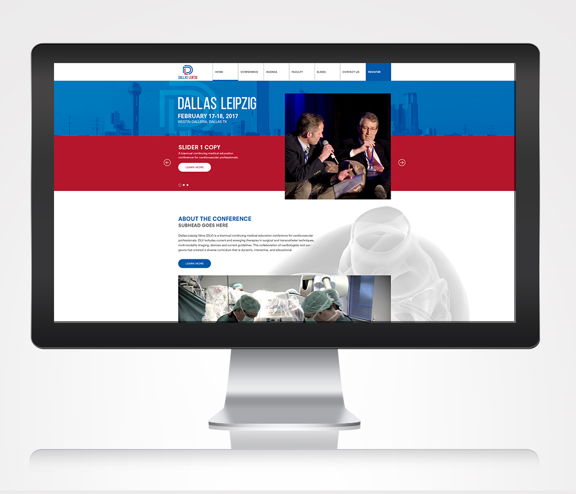

  

# Susan Delgado — Personal Portfolio

**Live site:** https://sdelgado.com

This repository hosts the personal portfolio of **Susan Delgado**, a multimedia developer and multidisciplinary creative working across web development, digital production, design, and fine art. The site is published with **GitHub Pages** and brings together two primary sides of the portfolio: **Fine Arts** and **Technical Work**.

  
  

## Fine Arts

The Fine Arts side presents selected painting, illustration, visual storytelling, wildlife and nature work, studies, exhibitions, and ongoing artistic development.

## Technical Work

The Technical Work side presents selected front-end development, responsive interfaces, digital production, design implementation, professional projects, case studies, and continuing technical study.

## About This Repository

This is an actively maintained personal portfolio rather than a reusable website template. In addition to publishing finished portfolio work, the repository is sometimes used as a working environment for builds, experiments, and exploration of new technologies before selected work becomes part of the public site.

The public website is available at **https://sdelgado.com**.

## Rights

Copyright © Susan Delgado. All rights reserved.

This repository is provided for viewing as a personal portfolio. No license is granted to copy, redistribute, adapt, republish, or reuse the site's original code, design, artwork, written content, or other original materials without express permission from Susan Delgado. Third-party and client trademarks or materials remain the property of their respective owners.
