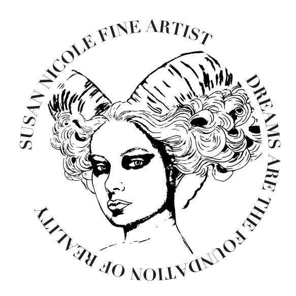
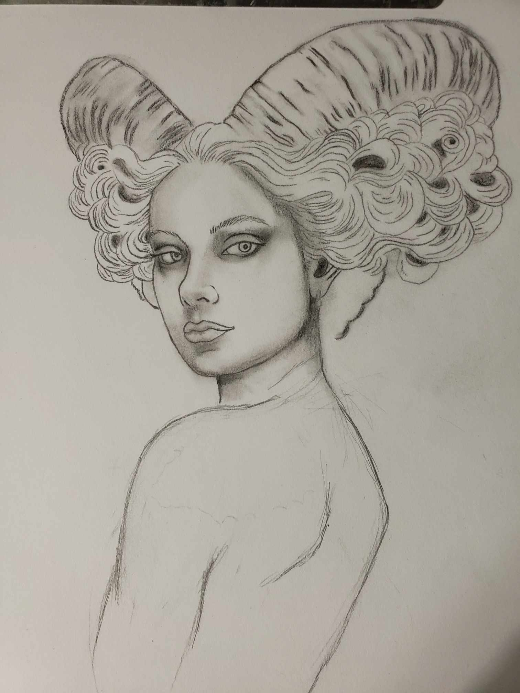
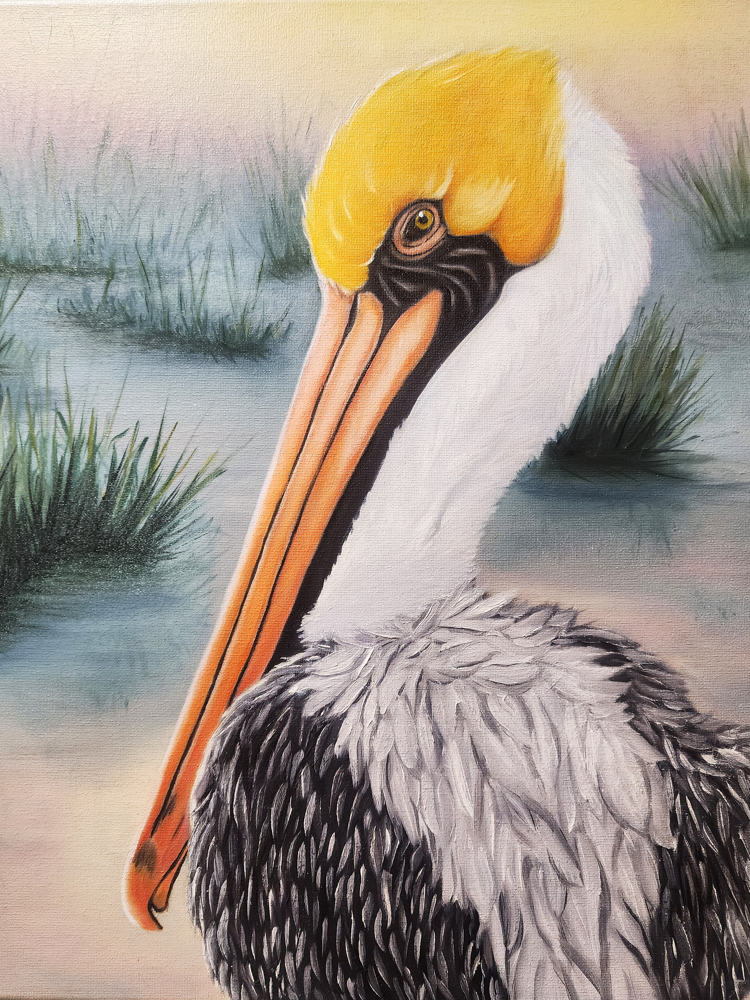

<p align="center">
  
</p>

# Susan Delgado — Portfolio Website

**Live site:** https://sdelgado.com  
**Repository:** https://github.com/susanndelgado/cv

This repository contains the source for Susan Delgado's multidisciplinary portfolio website, bringing together two primary areas of professional practice:

- **Fine Arts**
- **Technical Work**

The site uses a shared navigation and structural system while allowing the Fine Arts and Technical Work sections to maintain distinct visual identities. It functions as both a professional portfolio and a working archive of selected projects, case studies, exhibitions, artistic development, and technical experience.

---

## Portfolio Areas

<table>
  <tr>
    <td width="50%" valign="top">
      
      <br>
      <strong>Fine Arts</strong><br>
      Painting, illustration, visual storytelling, wildlife, academic studies, exhibitions, process documentation, and ongoing artistic development.
    </td>
    <td width="50%" valign="top">
      
      <br>
      <strong>Technical Work</strong><br>
      Front-end development, responsive interfaces, digital production, design implementation, email development, and technical case studies.
    </td>
  </tr>
</table>

---

## Fine Arts

The Fine Arts section presents painting, illustration, visual storytelling, academic studies, exhibitions, process documentation, and ongoing artistic development.

<p align="center">
  
</p>

Primary Fine Arts pages include:

- `finearts.html` — Fine Arts landing page
- `about.html` — Artist background, working process, and development
- `exhibits.html` — Exhibition history and current exhibition information
- `progress-chronicles.html` — Ongoing artistic progress and study documentation
- `gallery-narrative.html` — Narrative and symbolic work
- `gallery-wildlife.html` — Wildlife and nature work
- `gallery-decorative.html` — Decorative, whimsical, floral, and atmospheric work
- `gallery-studies.html` — Academic studies, classical studies, master copies, and related work

---

## Technical Work

The Technical Work section presents selected development, interface, digital production, design, and implementation projects.

The section includes:

- Selected technical and design projects
- Case studies
- Project filtering
- Development process documentation
- Skills and capability summaries
- Project-specific implementation details
- Resume and contact access

Supporting pages include:

- `work.html` — Technical portfolio landing page
- `project.html` — Individual technical project / case-study view
- `resume.html` — Web-based resume
- `contact.html` — Contact and professional information

---

## Technology

The site is primarily built with:

- HTML5
- CSS3
- JavaScript
- jQuery
- Bootstrap 5
- JSON-based project data

The project also uses:

- Responsive layouts
- CSS Grid and Flexbox
- Custom responsive breakpoints
- Dynamic project and case-study rendering
- Interactive filtering
- Image and media presentation
- Accessible navigation patterns
- Custom print styling for the resume
- Custom domain deployment support

---

## Project Data

Technical case-study information is maintained separately from the main HTML where practical.

### `js/casestudies.json`

Structured project and case-study data.

### `js/global.js`

Shared JavaScript behavior and dynamic site functionality.

This approach allows project information to be reused across portfolio views without duplicating the complete project content directly in each page.

---

## Styling

### `css/styles.css`

The primary stylesheet contains the shared site foundation as well as page-specific systems for:

- Global typography and controls
- Navigation
- Shared hero and media components
- Landing page
- Fine Arts
- Fine Arts galleries
- Exhibitions
- Progress Chronicles
- Technical Work
- Technical case studies
- Contact
- Resume
- Responsive layouts
- Reduced-motion support
- Print / resume formatting

The Fine Arts and Technical Work areas intentionally use different accent systems while remaining part of the same overall website.

---

## Directory Overview

```text
/
|-- index.html
|-- finearts.html
|-- about.html
|-- exhibits.html
|-- progress-chronicles.html
|-- gallery-narrative.html
|-- gallery-wildlife.html
|-- gallery-decorative.html
|-- gallery-studies.html
|-- work.html
|-- project.html
|-- contact.html
|-- resume.html
|
|-- css/
|   `-- styles.css
|
|-- js/
|   |-- global.js
|   `-- casestudies.json
|
|-- img/
|   `-- Site artwork, logos, and visual assets
|
|-- showcase/
|   `-- Technical portfolio and case-study assets
|
|-- tpl/
|   `-- Supporting templates
|
|-- Archived/
|   `-- Archived project/site material
|
|-- CNAME
|-- sitemap.xml
|-- robots.txt
`-- favicon.ico
```

---

## Running Locally

Because the site uses root-relative asset paths and JavaScript-driven content, it is best viewed through a local web server rather than by opening individual HTML files directly.

From the repository root:

```bash
python3 -m http.server 8000
```

Then open:

```text
http://localhost:8000
```

Other local development servers may be used as well.

---

## Deployment

The repository contains the files required for the public portfolio site, including a `CNAME` configuration for the custom domain.

**Current public site:** https://sdelgado.com

---

## Content and Assets

This repository contains a combination of:

- Original portfolio code
- Professional development work
- Fine-art portfolio imagery
- Case-study materials
- Resume content
- Exhibition documentation
- Supporting visual and project assets

Artwork, portfolio imagery, professional case-study content, and other original materials remain the property of their respective creator/owner unless otherwise noted.

---

## License

No open-source license is currently specified for this repository.

This repository is maintained as a personal and professional portfolio. Code, artwork, images, written content, and project materials should not be assumed to be licensed for redistribution or reuse.

---

## Development Status

This is an actively maintained portfolio.

Content, project case studies, visual presentation, responsive behavior, and technical documentation may continue to evolve as new work is completed and older work is reorganized.

---

## Developer Sandbox

A separate **Developer Sandbox** is being developed as an interactive environment for experiments, technical studies, reference material, development projects, and application-oriented work.

The Sandbox may be maintained in a separate repository and is intentionally not documented as part of this repository README at this stage.
